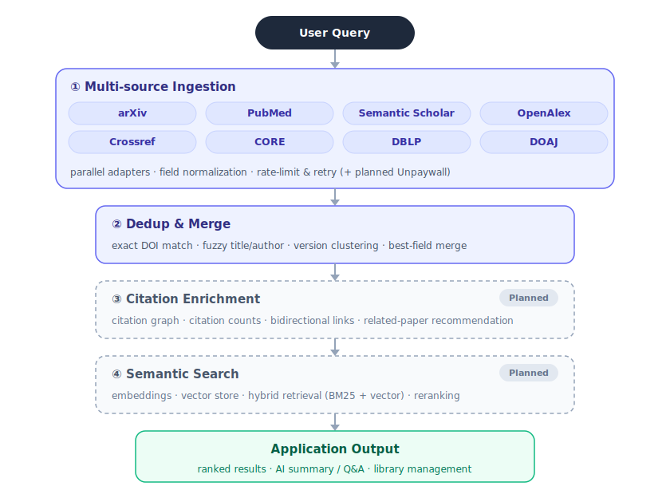

<div align="center">

# SG Hub

**AI-Powered Academic Literature Management Desktop App**

Open Source · Local-First · Privacy-Respecting

English · [简体中文](./README.zh-CN.md)

[](https://github.com/zmc0081/SGHUB/releases)
[](./LICENSE)
[](https://github.com/zmc0081/SGHUB/releases)

`Tauri 2` · `React 18` · `TypeScript` · `Rust` · `SQLite(FTS5)` · MIT License

</div>

---

## Overview

SG Hub is an open-source (MIT) desktop client for researchers that brings discovering, managing, reading, and translating literature into one local-first, privacy-respecting workspace. It offers multi-source aggregated search, keyword subscriptions with scheduled notifications, a literature database, a built-in PDF reader with full-text translation, AI-powered paper analysis, free-form chat, and BYOK multi-model configuration.

## Features

- **Multi-source search** — 8 sources in parallel (arXiv / PubMed / Semantic Scholar / OpenAlex / Crossref / CORE / DBLP / DOAJ), with DOI lookup, fuzzy title matching, and cross-source dedup & merge
- **Unified data sources** — a single global toggle in Settings; Literature Search and Today's Feed both query the same enabled set, so the three stay consistent
- **Subscriptions & notifications** — keyword subscriptions + scheduled local push (system tray)
- **Literature database** — nested folders + tags + local PDF upload & management; per-paper actions: View (built-in reader) / AI deep-read / Translate / File (reveal in folder) / Source / Move / Delete
- **Built-in PDF reader** — open PDFs in-app (pdf.js) with paging / zoom / fit-width / outline / in-page search / selectable text
- **Full-text translation** — LLM-powered, academic-grade translation that preserves structure (replace or side-by-side compare)
- **Open with external app** — hand a paper's local PDF to WPS / Adobe / any installed app, or the full-text link to the default browser
- **AI paper analysis** — deep-reading via Skills with streaming output; tasks keep running in the background across page switches, history is grouped by paper and persisted, and HTML reports are downloadable in one click (revealed in the file manager)
- **Bundled research Skill** — ships with `research-scientific-literature`: a professor-grade deep-read that produces an interactive tabbed HTML report
- **Claude-style chat** — in-composer model picker (grouped by provider, balance badges), copy / regenerate (with another model) / edit-and-resend / stop streaming, attachments (PDF / text / images via vision), and a "/" Skill palette
- **Model config (BYOK)** — Claude / GPT / DeepSeek / **Google Vertex (Gemini)** / local Ollama; API keys stored in the OS keychain
- **Keyless Google ADC** — use Vertex Gemini with local Application Default Credentials: no API key stored, tokens auto-refresh, corporate proxy supported (per-model or system proxy)
- **Fresh model presets + custom input** — per-provider model-id presets (kept current, e.g. Gemini 3.5 Flash) plus a free-form "Custom…" entry so new models are never blocked
- **AI Store** — ready-to-use model quotas from the standalone SG AI Store, integrated into the Models page
- **Privacy-first** — mandatory privacy-policy consent on first launch; data stays local by default

## Retrieval Layer Architecture

SG Hub's retrieval layer is a layered pipeline: multi-source ingestion → dedup & merge → citation enrichment → semantic search → application output.

<div align="center">



</div>

| Layer | Capability | Status |
|---|---|---|
| ① Multi-source ingestion | parallel adapters · field normalization · rate-limit & retry (8 sources + planned Unpaywall) | Done |
| ② Dedup & merge | exact DOI match · fuzzy title/author · version clustering · best-field merge | Done |
| ③ Citation enrichment | citation graph · citation counts · bidirectional links · related-paper recommendation | Planned |
| ④ Semantic search | embeddings · vector store · hybrid (BM25 + vector) · reranking | Planned |

## Tech Stack

| Layer | Technology |
|------|------|
| Framework | Tauri 2 (Rust backend + WebView frontend) |
| Frontend | React 18 + TypeScript 5 + Vite + TailwindCSS 3 + Zustand + TanStack Router |
| i18n | react-i18next (zh-CN / en-US) |
| Backend | Rust + tokio + rusqlite (SQLite + FTS5) + reqwest + keyring |
| PDF | pdf.js (render + text layer) + pdf-extract / lopdf (text extraction) |

## Installation

Download the installer for your platform from [Releases](https://github.com/zmc0081/SGHUB/releases):
- **Windows**: `SG.Hub_x.x.x_x64-setup.exe` (NSIS installer)
- **macOS**: `SG.Hub_x.x.x_universal.dmg` (Universal — Intel & Apple Silicon)

> On Windows, if SmartScreen appears, click "More info → Run anyway".
> macOS builds are currently unsigned; on first open use right-click → Open.
> Supports Windows 10 21H2+ and macOS 12+.

## Build from Source

```bash
# Prerequisites: Node.js >= 18, Rust, platform build deps
git clone https://github.com/zmc0081/SGHUB.git
cd SGHUB
npm install
npm run tauri dev      # dev mode
npm run tauri build    # build installers
```

## Privacy

- Data is stored locally by default; papers / PDFs / chat history are not uploaded
- In BYOK mode, requests go directly to the model provider, not through any SG Hub server
- Full-text translation sends only the selected document's text to the model you configured
- In AI Store mode, requests go through the sgaistore.com gateway, which records only usage metadata, not content
- API keys are stored in the OS keychain (Credential Manager / Keychain)

## License

[MIT](./LICENSE) © Star Technology

---

<div align="center">

Copyright © Star Technology. All Rights Reserved.

</div>

