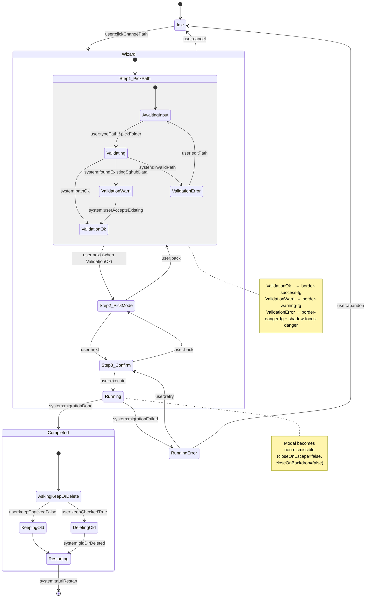
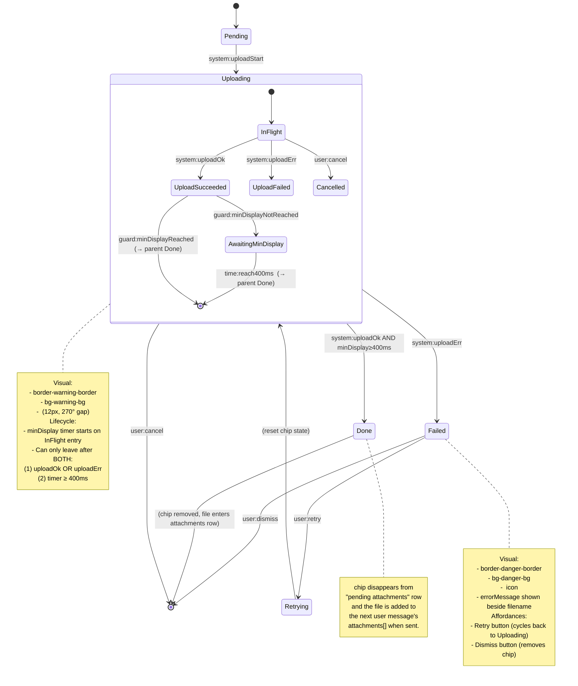
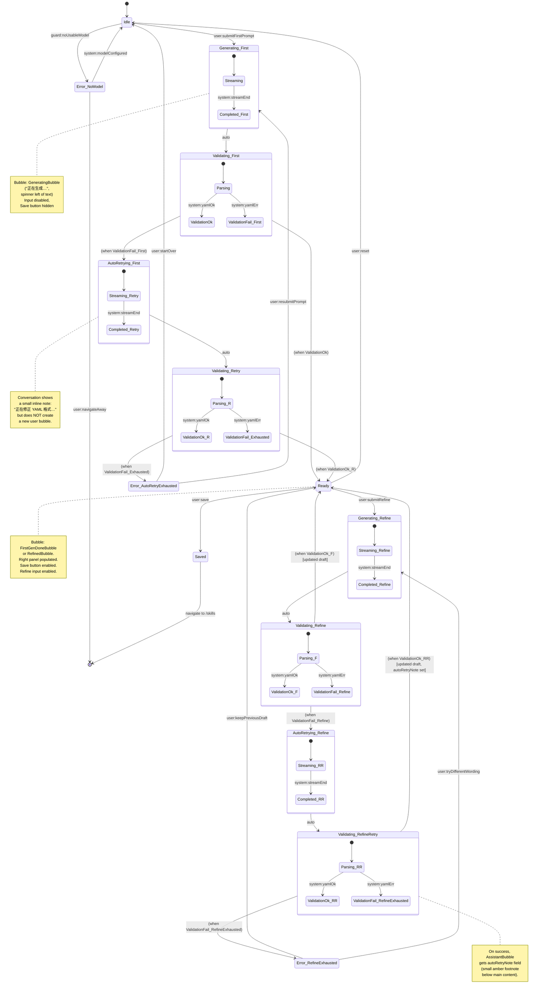
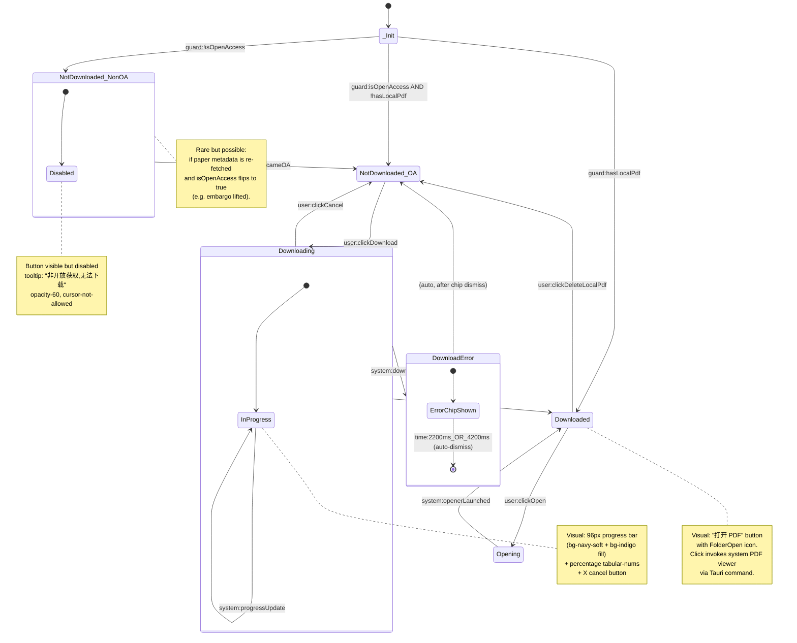

# SGHUB V2.2 — Interaction Flows

> 4 个复杂流程的形式化状态机描述。
>
> **目的**:为 Step 7 重构时的 store / hook 实现提供权威的状态转移依据,避免 V2.1.0 散落在组件中的隐式状态机被误重构。
>
> **格式**:每个流程用 Mermaid `stateDiagram-v2`,后附转换说明表 + 与 V2.1 偏离备注。
>
> **术语对齐**:状态名 `PascalCase`,与 Step 2 `component-specs.md` 一致。括号内中文简称便于设计师阅读。

---

## 0. 阅读约定

| Mermaid 元素 | SGHUB 语义 |
|---|---|
| `[*]` | 初始 / 终止 |
| `state Foo { ... }` | 复合状态(super-state),内部嵌套子状态 |
| `Foo --> Bar : trigger` | 用户/系统触发 trigger 后状态转移 |
| `note right of Foo` | 状态内的常驻 side-effect / UI 表征 |
| `--` | 复合状态内的「并发分支」或视觉分隔 |

每个流程后的「关键转换说明表」5 列含义:

| 列 | 含义 |
|---|---|
| from / to | 起止状态名(Mermaid 标识符) |
| trigger | 触发条件:`user:xxx` = 用户动作,`system:xxx` = 系统事件,`time:xxx` = 计时器 |
| side-effect | 状态进入时的副作用(Tauri 命令 / 状态写入 / 视觉变化) |
| notes | 引用 Step 2 spec 锚点 / V2.1 偏离 / 边界条件 |

---

## 1. DataDir 迁移向导

> 引用:Step 2 §A.8 DataDirCard + MigrationWizard
> 触发入口:Settings 页面 DataDirCard 的「修改路径」按钮

### 业务背景

用户在 Settings 页点击数据目录的「修改路径」会进入一个 3 步向导:**选择新路径 → 选择迁移模式 → 确认并执行**。整个流程是模态的,执行阶段(`Running`)不可取消(避免数据库写入中途崩溃)。完成后用户决定是否删除旧目录,然后应用强制重启以重新加载数据库连接。

向导任意一步都可以 Cancel 回退到 `Idle`(关闭向导),**但 `Running` 及之后不行**。

### 状态图

### 关键转换说明表

| from | to | trigger | side-effect | notes |
|---|---|---|---|---|
| `Idle` | `Step1_PickPath.AwaitingInput` | `user:clickChangePath` | 打开 `<BaseModal size="md">`,焦点进入路径输入框 | DataDirCard 「修改路径」按钮 |
| `AwaitingInput` | `Validating` | `user:typePath` / `pickFolder` | 200ms debounce 后调用 Tauri `validate_data_dir_path` 命令 | 输入框 onChange,latest-call guard |
| `Validating` | `ValidationOk` | `system:pathOk` | 输入框 `border-success-fg` + 下方绿字提示 + 「下一步」启用 | 校验通过(可写、有空间、无现存数据) |
| `Validating` | `ValidationWarn` | `system:foundExistingSghubData` | 输入框 `border-warning-fg` + 下方琥珀字提示 + 「使用已有数据」radio card 在 Step2 可见 | 路径已含 SGHUB 数据,Step2 提供「使用已有数据」选项 |
| `Validating` | `ValidationError` | `system:invalidPath` | 输入框 `border-danger-fg shadow-focus-danger` + 下方红字 + 「下一步」禁用 | 错误类型:无写权、路径不存在、磁盘满 |
| `ValidationWarn` | `ValidationOk` | `user:userAcceptsExisting` | 内部 flag `acceptedExistingData=true` | 用户在 ValidationWarn 文案下点击「我了解,继续」 |
| `ValidationError` | `AwaitingInput` | `user:editPath` | 清除错误提示,但保留用户输入 | 重新输入时校验复跑 |
| `Step1_PickPath` | `Step2_PickMode` | `user:next` (when `ValidationOk`) | 焦点跳到 3 张 radio card 第一张 | 「下一步」按钮 |
| `Step2_PickMode` | `Step3_Confirm` | `user:next` (after mode picked) | 焦点跳到「执行」按钮 | mode ∈ {`migrate`, `fresh`, `use-existing`} |
| `Step3_Confirm` | `Running` | `user:execute` | (1) Modal 锁定不可关闭;(2) 调用 Tauri `migrate_data_dir`;(3) 订阅 `data_migration:progress` 事件 | 红色警告 banner 已展示「不可中途关闭」 |
| `Running` | `Completed.AskingKeepOrDelete` | `system:migrationDone` | 进度条到 100%,弹出复选框「删除旧目录」(**默认 false**) | 复选默认 false 是 V2.2 偏离 V2.1 的安全选择 |
| `Running` | `RunningError` | `system:migrationFailed` | inline 错误 banner + Cancel 解锁 + 提供「重试 / 放弃」 | 例如目标磁盘中途满 |
| `RunningError` | `Step3_Confirm` | `user:retry` | 重置进度条,保留所有选项 | 用户在解决磁盘问题后点重试 |
| `RunningError` | `Idle` | `user:abandon` | 关闭向导,旧数据目录保持不变 | 「放弃」是最终态 |
| `AskingKeepOrDelete` | `KeepingOld` | `user:keepCheckedFalse` → 点击「立即重启」 | 旧目录保留(默认行为) | 复选默认 false 进入这里 |
| `AskingKeepOrDelete` | `DeletingOld` | `user:keepCheckedTrue` → 点击「立即重启」 | 调用 Tauri `delete_old_data_dir` | 删除是异步的,失败也继续重启 |
| `KeepingOld` / `DeletingOld` | `Restarting` | (immediate) | Modal 内容切换为「正在重启…」全屏 spinner | 见 Settings.draft SettingsPageRestarting |
| `Restarting` | `[*]` | `system:tauriRestart` | Tauri `relaunch()` 调用 | 终态,新进程已起 |
| Wizard | `Idle` | `user:cancel` | 关闭向导,丢弃所有输入 | 仅 Step1/2/3 有效,Running 之后无效 |

### V2.1 → V2.2 变化备注

| 项 | V2.1 | V2.2 |
|---|---|---|
| 复选默认值 | 默认勾选「保留旧目录」(反向逻辑) | **默认不勾选「删除旧目录」**(正向逻辑,更安全) |
| `RunningError` 出现路径 | 直接弹原生 `alert()` | 内联 banner + 重试 / 放弃两个明确选项 |
| Validation 错误视觉 | 红字提示 | + `border-danger-fg` + `shadow-focus-danger` 强化输入框边框 |
| Cancel 覆盖范围 | 各步独立写 Cancel handler | 用 BaseModal `closeOnEscape` 统一,Running 时通过 prop 关闭 |

---

## 2. Chat 附件 chip 三态 FSM

> 引用:Step 2 §A 各处提到 SpinnerRing,以及 Chat.draft.tsx `AttachmentChip` 组件
> 触发入口:Chat InputArea 拖入 / 粘贴 / 点击 + 菜单上传

### 业务背景

用户在 Chat 中上传附件时,每个文件对应一个 chip,显示在 InputArea 上方的 attachments 行。chip 有 3 个视觉态:**上传中(黄边 + SpinnerRing 旋转)→ 完成(消失,文件进 attachments)/ 失败(红边 + X)**。

**最小可见 400ms 锁定**:上传可能很快(本地 1MB PDF <100ms),如果 chip 立刻消失,用户根本看不见「正在上传」的视觉反馈,反而觉得「啥都没发生」。所以即使上传 50ms 完成,chip 也要再展示 350ms 才能离场,确保用户感知。

失败状态用户可重试或手动关闭。

### 状态图

### 关键转换说明表

| from | to | trigger | side-effect | notes |
|---|---|---|---|---|
| `[*]` | `Pending` | `user:drop` / `paste` / `pickFile` | chip 创建,占位 grey 边框,准备上传 | 通常 ≤50ms,几乎不可见 |
| `Pending` | `Uploading.InFlight` | `system:uploadStart` | (1) 调用 Tauri `upload_attachment` 命令;(2) 启动 400ms `minDisplay` 计时器;(3) chip 视觉切到 warning |  |
| `InFlight` | `UploadSucceeded` | `system:uploadOk` | 写入 `uploadResult.success`,但仍在 Uploading 复合态内 | upload 完成 < 400ms 时会进 AwaitingMinDisplay |
| `UploadSucceeded` | `Uploading.[*]` → `Done` | `guard:minDisplayReached` | 立即离开 Uploading,chip 从行内消失 | 已达 400ms 时直接走 |
| `UploadSucceeded` | `AwaitingMinDisplay` | `guard:minDisplayNotReached` | 视觉仍是 SpinnerRing(没切到 success 也没消失) | 上传比 400ms 还快 |
| `AwaitingMinDisplay` | `Uploading.[*]` → `Done` | `time:reach400ms` | 计时器触发 | 计时器在 InFlight 入态时启动 |
| `InFlight` | `UploadFailed` → `Failed` | `system:uploadErr` | 错误立即可见,**不等 minDisplay**(错误比延迟可见更重要) | 例如 50MB 限制、网络错误 |
| `InFlight` | `[*]` | `user:cancel` | 调用 Tauri `cancel_upload` + chip 移除 | 失败的取消是「优雅放弃」,不弹 toast |
| `Failed` | `Retrying` → `Uploading` | `user:retry` | 重置 chip 状态、清错误,重新上传 | retry 计数器无上限(用户自己控制) |
| `Failed` | `[*]` | `user:dismiss` | chip 移除,不重试 | X 按钮 |
| `Done` | `[*]` | (immediate) | chip 从 `pendingAttachments` 数组移除,文件加入下一条消息的 `attachments[]` | chip 消失是同步动作,无动画(动画 90% 已在 Uploading 期间消耗) |

### V2.1 → V2.2 变化备注

| 项 | V2.1 | V2.2 |
|---|---|---|
| Loader 视觉 | 通用 `Loader2` spin 圆圈 | **`SpinnerRing`(270° gap)** 类 Claude 风格 |
| minDisplay 400ms | 已有,但实现是组件内部 `setTimeout` | 上抬到 FSM 显式状态(`AwaitingMinDisplay`)便于测试 |
| Retry 行为 | 仅清错误状态 + 重新上传 | 显式 `Retrying` 中间态,允许未来加 backoff |
| 颜色 token | hardcoded yellow / red | `warning-*` / `danger-*` token 化 |

---

## 3. SkillGenerator refine + auto-retry

> 引用:Step 2 §A.7 SkillEditor (邻近) + SkillGenerator.draft.tsx 5 种气泡形态
> 触发入口:SkillGenerator 页面用户提交首次描述 / refine 反馈

### 业务背景

SkillGenerator 是对话式 Skill 创建工具。用户描述需求 → AI 生成 YAML → 系统**校验 YAML 合法性** → 渲染右侧预览。校验失败时,系统**自动重试一次**(prompt 里追加错误信息让 AI 修正)——这能解决 YAML 缩进、字段缺失等常见 LLM 输出问题。重试失败则提示用户重新描述需求。

「Refine」和「首次生成」走同一个流程,区别只在送给 AI 的 prompt:
- **首次生成**:用户描述 → 全新 prompt
- **Refine**:用户反馈 → 在现有 YAML 基础上 + 用户反馈做增量更新

AutoRetry **最多 1 次**(防止 LLM 进入无限错误循环)。

### 状态图

### 关键转换说明表

| from | to | trigger | side-effect | notes |
|---|---|---|---|---|
| `Idle` | `Generating_First.Streaming` | `user:submitFirstPrompt` | 调用 Anthropic/OpenAI API stream,左侧加 UserBubble + AssistantBubble(generating variant)| 第一次提交,prompt 是模板「生成一个新 Skill」 |
| `Idle` | `Error_NoModel` | `guard:noUsableModel` | 显示 NoModelBanner;input disabled | 在 Models 页配置了 Key 失效或没模型时 |
| `Streaming` | `Completed_First` | `system:streamEnd` | 流式结束,文本完整 | 没有显式光标了 |
| `Generating_First` | `Validating_First.Parsing` | `auto` | 用 yaml 库解析 AI 生成内容,提取 SkillDraft | 自动,无 UI 提示 |
| `Validating_First` | `Ready` | `system:yamlOk` | AssistantBubble 切到 `first-done` variant,右侧 ConfigPanel 渲染,Save 启用 | 一次过的快乐路径 |
| `Validating_First` | `AutoRetrying_First.Streaming_Retry` | `system:yamlErr` | 系统注入 prompt:`"上次生成的 YAML 解析失败,错误:<msg>。请修正后重新输出"`,**不**创建新 UserBubble | 设计上隐藏「重试」对用户感知,只用 autoRetryNote 显示 |
| `Validating_Retry` | `Ready` | `system:yamlOk` | 同上,AssistantBubble 进入 first-done variant,**autoRetryNote 设为「已自动重试修正」**(对应 `AutoRetryBubble` 形态,前缀展示 `Lightbulb` icon) | autoRetryNote 让用户知情但不打扰 |
| `Validating_Retry` | `Error_AutoRetryExhausted` | `system:yamlErr` | 显示「自动重试 1 次后仍失败,请尝试调整你的描述」红色提示 | 重试上限 = 1 |
| `Error_AutoRetryExhausted` | `Idle` | `user:startOver` | 清空所有对话,回到初始 | 「重新开始」红色链接 |
| `Error_AutoRetryExhausted` | `Generating_First` | `user:resubmitPrompt` | 用户改写需求重新发,走首次生成流 | 不算 refine,因为没有可用基础 |
| `Ready` | `Generating_Refine.Streaming_Refine` | `user:submitRefine` | 调用 API,prompt = 「当前 YAML + 用户反馈,产出更新版」;UserBubble + AssistantBubble(generating) | refine 与首次生成共享 Streaming 视觉 |
| `Validating_Refine` | `Ready` | `system:yamlOk` | 旧 draft 被新 draft 替换;右侧 ConfigPanel 重渲染;AssistantBubble 切 `refined` variant | 「已根据反馈更新」 |
| `Validating_RefineRetry` | `Ready` | `system:yamlOk` | 同上 + autoRetryNote 设 | 对应 AutoRetryBubble 形态 |
| `Validating_RefineRetry` | `Error_RefineExhausted` | `system:yamlErr` | 提示「保留上一版,或换说法重试」 | 与首次失败的区别:这里有 Ready 可以回退 |
| `Error_RefineExhausted` | `Ready` | `user:keepPreviousDraft` | 丢弃失败的 refine,Ready 保持原 draft | 「保留上一版」 |
| `Error_RefineExhausted` | `Generating_Refine` | `user:tryDifferentWording` | 用户重写 refine 描述发新一轮 | 不创建新的 retry,只是新的一轮 generation |
| `Ready` | `Saved` | `user:save` | (1) 调用 Tauri `save_skill` 命令;(2) 跳 `/skills` | Save 按钮在 Ready / Refine-done 两种态可用 |
| `Ready` | `Idle` | `user:reset` | 清空对话和 draft | 「重新开始」 |

### V2.1 → V2.2 变化备注

| 项 | V2.1 | V2.2 |
|---|---|---|
| AutoRetry 上限 | 隐式 = 1(代码里写死) | **显式状态机表达**,`AutoRetrying_First` vs `AutoRetryExhausted` 分支 |
| AutoRetry 视觉 | 无差异化,失败重试时也是普通 generating 气泡 | **AutoRetryBubble 形态**,在 AssistantBubble 主文案下加 `autoRetryNote`(琥珀色小字)告知用户 |
| Refine 失败处理 | 直接报错替换原 draft | **保留上一版 Ready 状态**,用户可选「保留 / 重试」 |
| 「重新开始」交互 | window.confirm | ConfirmDialog (Step 2 §B.3) — V2.2 通用替换 |
| 「无可用模型」 | banner + 输入禁用,但 BSD-style 简单 | 独立 `Error_NoModel` 状态,有明确从「配置好模型 → 自动回 Idle」的恢复路径 |

---

## 4. PaperActions PDF 下载三态

> 引用:Step 2 §A.4 PaperActions(PDF 槽三态)+ Search.draft.tsx PaperActionsInline + Library.draft.tsx 类似按钮
> 触发入口:任意文献卡片的 PDF 按钮

### 业务背景

每张文献卡都有一个「PDF 槽」按钮,根据文献状态显示 3 种 UI:**下载(未下载且开放获取)/ 进度条(下载中)/ 打开(已有本地 PDF)**。如果文献不是 OA(open access),按钮永久 disabled 显示「下载 PDF」但不可点。

下载中可以取消;取消后回到 `NotDownloaded_OA`,本地不留半成品。

下载失败时显示 inline error chip(2.2 / 4.2s 自动消失,见 §A.4),状态回到 `NotDownloaded_OA`。

### 状态图

### 关键转换说明表

| from | to | trigger | side-effect | notes |
|---|---|---|---|---|
| `[*]` | `NotDownloaded_NonOA` | `guard:!isOpenAccess` | 按钮可见但 disabled,tooltip 显示「非开放获取,无法下载」 | 非 OA 文献永久这个态(除非元数据更新) |
| `[*]` | `NotDownloaded_OA` | `guard:isOpenAccess AND !hasLocalPdf` | 按钮显示「下载 PDF」+ `Download` icon,可点 |  |
| `[*]` | `Downloaded` | `guard:hasLocalPdf` | 按钮显示「打开 PDF」+ `FolderOpen` icon | 已下载状态 |
| `NotDownloaded_OA` | `Downloading.InProgress` | `user:clickDownload` | (1) 调 Tauri `download_pdf` 命令;(2) 订阅 progress 事件;(3) UI 切到进度条 |  |
| `InProgress` | `InProgress` | `system:progressUpdate` | 进度条更新百分比(0-100) | 自循环边表示频繁更新 |
| `Downloading` | `Downloaded` | `system:downloadOk` | (1) 写入本地路径;(2) UI 切到「打开 PDF」按钮;(3) **Library 卡片左侧色条**可能 unread → reading(若用户偏好) |  |
| `Downloading` | `NotDownloaded_OA` | `user:clickCancel` | (1) 调 Tauri `cancel_download` + `downloadId`;(2) 删除半成品文件(若有);(3) UI 切回「下载 PDF」 | X 按钮 |
| `Downloading` | `DownloadError.ErrorChipShown` | `system:downloadErr` | inline error chip:`⚠ <message>`,`bg-danger-bg text-danger-fg` | 显示时长 2200ms(短错误)或 4200ms(长错误,如包含文件路径) |
| `ErrorChipShown` | `[*]` (→ `NotDownloaded_OA`) | `time:auto-dismiss` | chip 淡出后状态自动回 NotDownloaded_OA | 不留半成品 |
| `Downloaded` | `Opening` | `user:clickOpen` | 调 Tauri `open_pdf_with_default_app` | Opening 是瞬态,通常 <100ms |
| `Opening` | `Downloaded` | `system:openerLaunched` | 无 UI 变化(外部 app 已开),按钮回到 idle hover 态 |  |
| `Downloaded` | `NotDownloaded_OA` | `user:clickDeleteLocalPdf` | (Library 「♻ 重新提取」+ 可能的「删除本地」组合行为) | 不直接暴露在 PaperActions 工具栏,通常通过 Library 侧入口 |
| `NotDownloaded_NonOA` | `NotDownloaded_OA` | `system:paperBecameOA` | 元数据 re-fetch 后 isOpenAccess 翻为 true | 罕见,但理论合法(embargo 解除) |

### V2.1 → V2.2 变化备注

| 项 | V2.1 | V2.2 |
|---|---|---|
| 状态机本体 | 行为相同 | 仅视觉走 V2.2 token(`bg-indigo` 进度条、`shadow-card` chip 等) |
| 错误 chip | 硬编码 red bg + 时长 | token 化(`bg-danger-bg`)+ 时长从代码常量明确为 2200/4200ms |
| Disabled 视觉 | `opacity-50 + cursor-not-allowed` | `opacity-60 cursor-not-allowed` + 加 hover 反向覆写不让按钮在 hover 时变色 |
| 「打开 PDF」icon | `📂` emoji | Lucide `FolderOpen` |
| 取消按钮 | 红色 `X` 字符 | Lucide `X` icon,圆形 hover `bg-danger-bg` |

---

## 5. 状态机交叉引用矩阵

各状态机入口 / 触发组件 / 涉及 spec 锚点速查:

| 状态机 | 入口组件 | Spec 锚点 | 关联状态机 |
|---|---|---|---|
| §1 DataDir 迁移向导 | DataDirCard.onChangePath | Step 2 §A.8 | (独立,无外部联动) |
| §2 Chat 附件 chip | Chat InputArea (drop/paste/PlusMenu) | Step 2 §B.5 Skeleton (借鉴 minDisplay 思路) | 间接关联 §4(用户可能从 PDF 下载完后拖入 Chat) |
| §3 SkillGenerator | /skills/generate page mount | Step 2 §A.7 SkillEditor (相邻规格) | 触发 Toast (Step 2 §B.1) |
| §4 PDF 下载 | PaperActions PDF slot button | Step 2 §A.4 | 触发 Toast 失败提示 |

---

## 6. 自检

| # | 检查项 | 结果 |
|---|---|---|
| 1 | 4 个流程全部覆盖 | ✓ DataDir 迁移、Chat chip、SkillGenerator refine+retry、PDF 下载 |
| 2 | 每个流程 = Mermaid + 转换表 + V2.1 备注 3 部分 | ✓ |
| 3 | 状态名 PascalCase 且与 Step 2 一致 | ✓ Generating / Validating / Uploading / Downloading 等术语一致 |
| 4 | Mermaid 语法合法(stateDiagram-v2) | ✓ 4 个图都用 v2 语法 + composite states |
| 5 | trigger 区分 user / system / time / guard / auto | ✓ 5 类前缀显式 |
| 6 | side-effect 提及 Tauri 命令或 store 写入 | ✓ 关键状态都标了 |
| 7 | V2.1 偏离点显式记录 | ✓ 每流程末尾「变化备注」表 |
